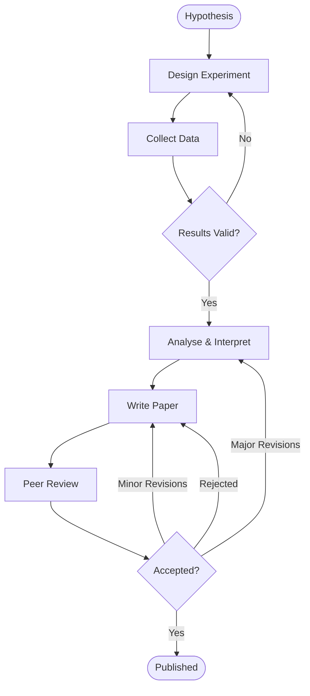
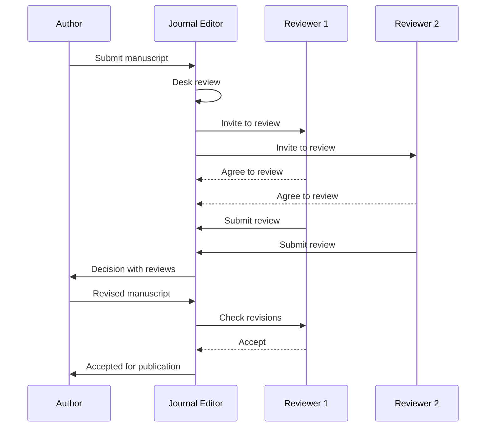
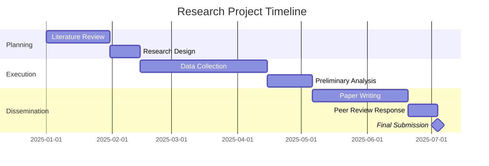
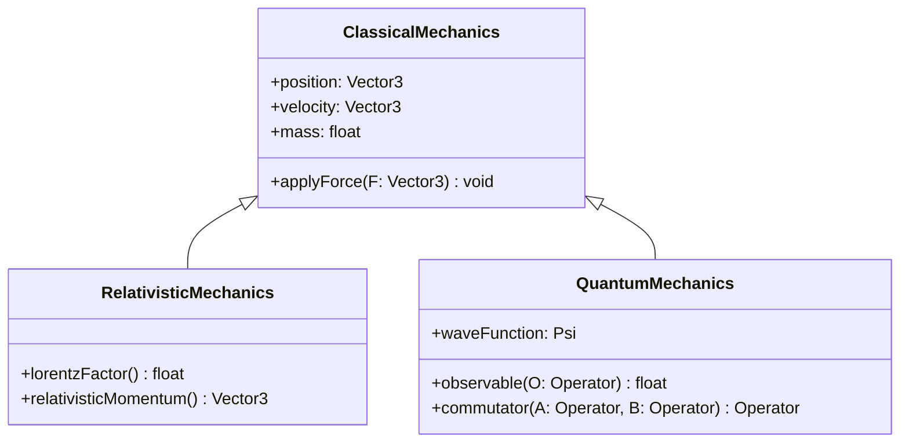
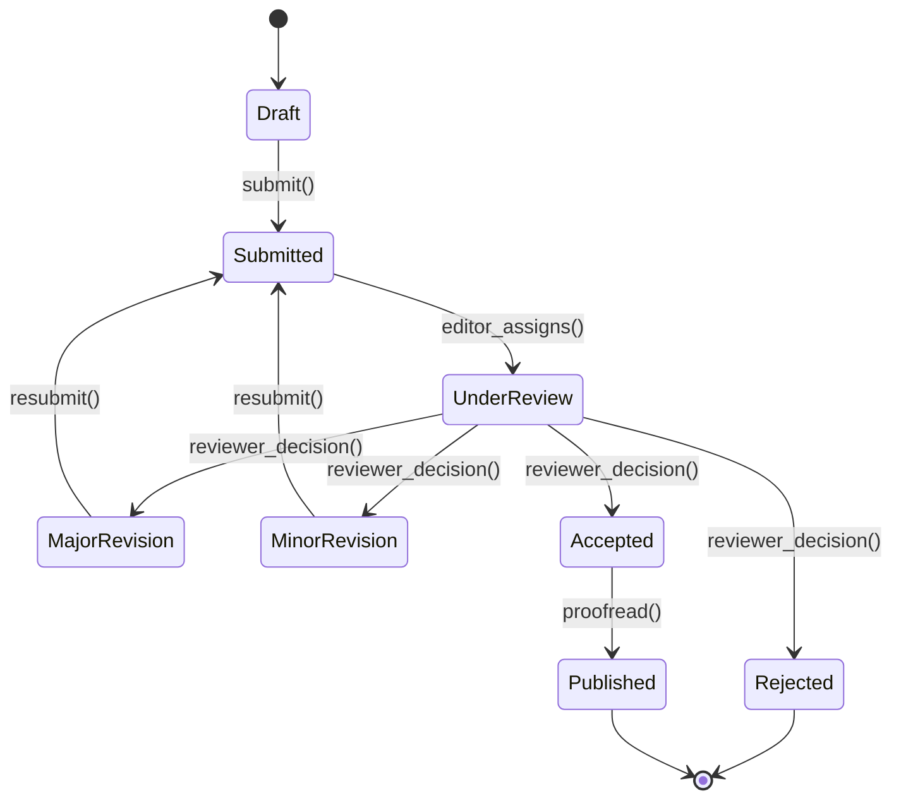
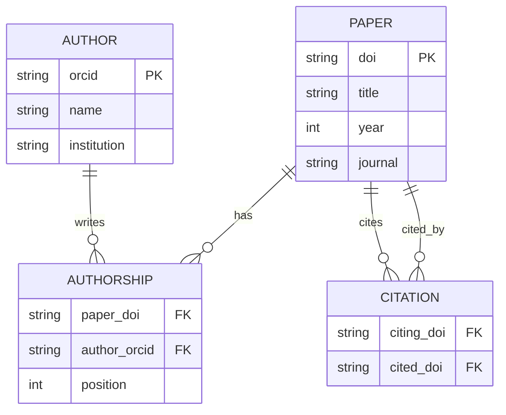

[Mermaid](https://mermaid.js.org/) lets you write diagrams as code — no drawing tools needed.
Enable it per post with `mermaid: true` in your frontmatter.

## Flowchart

A typical research workflow from hypothesis to publication:



## Sequence Diagram

The lifecycle of a manuscript through peer review:



## Gantt Chart

A six-month grant project timeline:



## Class Diagram

A hierarchy of mechanics models:



## State Diagram

Manuscript states through the publishing pipeline:



## ER Diagram

A simple citation graph schema:



## Usage

Enable Mermaid in any post by adding `mermaid: true` to frontmatter:

```yaml
---
title: My Post
mermaid: true
---
```

Then write diagrams inside fenced code blocks tagged `mermaid`. All diagram types from
[mermaid.js.org](https://mermaid.js.org/intro/) are supported, including pie charts, git graphs,
mind maps, and timeline diagrams.
